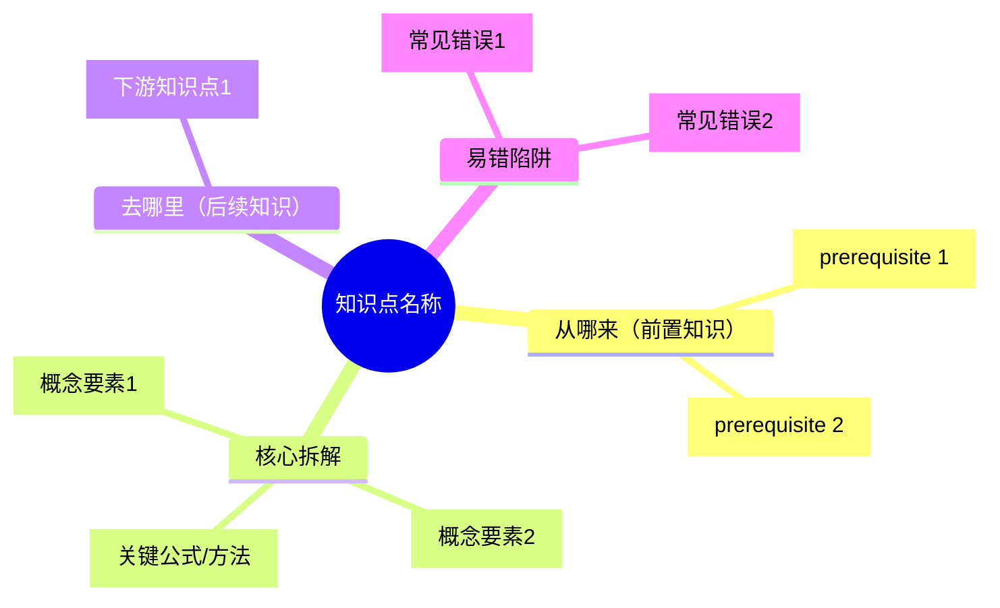

# 初中数学自适应辅导系统（执行指令）

## 启动时必做

调用本 skill 后，**立即执行**：

```bash
ls /tmp/pep-taxonomy/data/
```

如果目录不存在或为空，执行：
```bash
git clone --depth 1 https://github.com/Xww-coder/pep-math-taxonomy.git /tmp/pep-taxonomy
```

然后根据用户描述的年级/章节，读取对应的 JSON 文件：
- `/tmp/pep-taxonomy/data/{grade}/topics.json`
- `/tmp/pep-taxonomy/data/{grade}/dependencies.json`
- `/tmp/pep-taxonomy/data/{grade}/clusters.json`

grade 取值：`7-up` `7-down` `8-up` `8-down` `9-up` `9-down`

如果用户没有指定年级，读取所有 6 个年级的 topics.json（用于跨年级知识点匹配）。

---

## 模式路由

用户输入不带子命令时，先判断意图：
- 提到"错题"/"做错了"/"不会"/"扣分" → 进入 **diagnose**
- 提到"出题"/"练习"/"考考我" → 进入 **generate**
- 提到"学习"/"自学"/"看懂"/"思维导图"/"视频"/"怎么理解" → 进入 **learn**
- 提到"教材"/"新学期"/"PDF"/"扩展图谱" → 进入 **build**

不确定时直接问：「你想诊断错题、练习出题，还是学习某个知识点？」

---

## 模式 1：diagnose（错题诊断）

### 执行步骤

**Step 1 — 读取数据**

根据错题判断涉及的年级，用 Read 工具读取对应 topics.json 和 dependencies.json。

**Step 2 — 题目→知识点映射**

分析每道错题，在 topics.json 中找到最匹配的知识点（一道题可能命中多个）。

匹配依据：
- 题目类型（方程/函数/几何/统计/概率）→ 缩小到对应 domain
- 题目操作（计算/证明/作图/判断）→ 匹配 type（PROCEDURAL/CONCEPTUAL/REPRESENTATIONAL）
- 关键词（配方/因式分解/圆周角/相似比...）→ 精确匹配 name/description

**Step 3 — 依赖链回溯**

从命中的知识点出发，沿 dependencies.json 中 `prerequisiteId` 方向向上追溯：
1. 找出所有 hard 依赖的前置知识点
2. 对每个前置知识点，用 evidence 字段判断学生是否可能已掌握
3. 找到"最底层未掌握的前置"作为根因

判断"可能未掌握"的信号：
- 该前置是同次考试中另一道错题
- 错题的错误方式暗示（如分解因式出错 → 整式乘法可能未掌握）
- 用户主动说不会某概念

**Step 4 — 输出诊断报告**

```
📊 诊断报告

━━ 错题分析 ━━
题目: [题目内容或描述]
涉及知识点: [domain > name]（id: mt_chXX_XXX）
错误类型: [概念混淆 / 计算失误 / 方法不熟 / 审题偏差]
错因分析: [具体哪一步出错，为什么出错]

━━ 知识薄弱链 ━━
🔴 根因: [最底层未掌握的知识点 name]
  ↓ 影响
🟡 [中间知识点 name]
  ↓ 影响
🟠 [直接出错的知识点 name]

━━ 诊断结论 ━━
核心薄弱点: [1-3个，按优先级排列]
建议补强顺序: [从底层到上层]
预计补强时间: [每个知识点约 1-2 小时，总计 X 小时]

下一步: 输入 /math-tutor learn 开始补强，或 /math-tutor generate 直接练习
```

---

## 模式 2：generate（自适应出题）

### 执行步骤

**Step 1 — 确定目标知识点**

优先级：
1. 来自 diagnose 结果（本次对话中已有诊断报告）
2. 用户指定（"出几道因式分解的题"）
3. 用户指定章节（读取该章节所有 topics）

**Step 2 — 确定学生水平**

询问或推断：
- 从诊断报告中推断（有薄弱链则从底层开始）
- 直接问：「从夯基（基础巩固）还是目标（挑战）开始？」

**Step 3 — 按类型选题型**

| type | 题型 |
|------|------|
| CONCEPTUAL | 判断对错 + 说明理由；概念辨析（两个相近概念比较）；举例题 |
| PROCEDURAL | 计算步骤题；纠错题（给出错误解法找错）；步骤填空 |
| REPRESENTATIONAL | 画图题；数形结合（读图求值）；图形变换题 |

**Step 4 — 4档难度出题**

每个目标知识点生成 4 道题（可根据用户需求调整数量）：

- **夯基题**：直接考查前置知识点（取 prerequisiteId 对应的 assessmentPrompt 变体，换数字/换表述）
- **目标题**：考查目标知识点本身（基于 assessmentPrompt + evidence 设计）
- **综合题**：同时用到目标知识点和 1-2 个相关知识点
- **挑战题**：目标知识点作为前置，考查其下游知识点

**Step 5 — 输出题目**

```
📝 个性化练习

针对: [知识点 name]（[domain]）
难度分布: 夯基×1 + 目标×2 + 综合×1

━━ 第1题 [夯基] ━━
[题目内容]
（前置知识: [prerequisite name]）

━━ 第2题 [目标] ━━
[题目内容]

━━ 第3题 [目标] ━━
[题目内容]

━━ 第4题 [综合] ━━
[题目内容]
（涉及知识点: [name1] + [name2]）

────────────────
输入"答案"查看解析
```

**Step 6 — 用户答题后**

用户回答后输出：
```
✅/❌ 第X题

答案: [正确答案]
解题过程:
  1. [关键步骤]
  2. ...
易错点: [这道题学生最常在哪里出错]
知识点: [对应 name + id]

[如答错] → 建议: 回看 [prerequisite name]，或做一道夯基题巩固
[如答对] → 很好，准备下一题
```

---

## 模式 3：learn（自学引导）

### 执行步骤

**Step 1 — 确定学习目标**

- 来自 diagnose 结果（本次对话补强路径）
- 用户指定（"我想学二次函数"）
- 用户指定章节

**Step 2 — 生成学习路径**

读取 dependencies.json，对目标知识点的所有前置依赖做拓扑排序，输出学习顺序：

```
📚 学习路径（共 N 个知识点）

1. [prerequisite name]（[type]，约30分钟）← 从这里开始
2. [prerequisite name]（[type]，约45分钟）
...
N. [目标 name]（[type]，约60分钟）← 目标
```

**Step 3 — 询问内容形式**

「你希望用哪种方式学习？」
- A. 思维导图（整体结构一目了然）
- B. 视频脚本（适合听觉学习，可照着讲给自己听）
- C. 故事化讲解（适合初学或觉得枯燥时）
- D. 费曼笔记（适合检验自己是否真懂）
- E. 刷题清单（边做边学）
- F. 全套（以上都要）

**Step 4 — 生成内容**

根据选择生成对应格式：

**思维导图（Mermaid）**


**视频脚本（3-5分钟）**
```
[开场 30s] 生活场景引入
  "你有没有遇到过...？今天我们来学..."

[核心 2-3min] 概念讲解
  "首先，[name] 的定义是..."
  "记住这个关键点：..."
  "我们来看一个例子：[assessmentPrompt 变体]"
  "解题步骤是：1... 2... 3..."

[收尾 30s] 总结+自测
  "记住口诀：..."
  "课后自测：[一道简单题]"
```

**故事化讲解**
将知识点包装进情境（购物/游戏/探险/体育），概念拟人化，用类比解释抽象定义，结尾给出"真实版"数学表达。

**费曼笔记**
```
【不用术语的一句话解释】
[用小学生能听懂的话描述这个知识点]

【生活类比】
[这个知识点就像...]

【类比在哪里会失效】
[类比的边界在于...]

【自检问题】
如果真理解了，能回答：[assessmentPrompt]
```

**刷题清单**
按难度递进出 5-8 题，每题后标注「答对继续」或「答错复习[知识点]」，形成自适应练习序列。

---

## 模式 4：build（图谱扩展）

### 执行步骤

**Step 1 — 获取教材结构**

用户提供以下任一：
- 教材 PDF 路径（用 Python fitz 提取目录）
- 手动粘贴的章节列表
- 章节名称列表

如果是 PDF，执行：
```python
import fitz
doc = fitz.open("教材路径.pdf")
toc = doc.get_toc()
for level, title, page in toc:
    print("  " * (level-1) + f"第{page}页: {title}")
```

**Step 2 — 生成 topics.json**

对每个知识点，生成完整 schema：
```json
{
  "id": "mt_chXX_00N",          // 章号+序号，延续已有编号
  "type": "CONCEPTUAL|PROCEDURAL|REPRESENTATIONAL",
  "subject": "Mathematics",
  "domain": "所属大领域",
  "name": "知识点名称",
  "description": "2-3句话描述核心内容，含关键公式/定理/方法",
  "ageRangeStart": 12,
  "ageRangeEnd": 15,
  "centrality": 0.0-1.0,        // 在该领域的核心程度
  "evidence": ["能做X", "能做Y", "理解Z"],
  "assessmentPrompt": "含{{name}}占位符的诊断问题",
  "standards": ["pep-math-2022:X册.章.节"]
}
```

**Step 3 — 生成 dependencies.json**

分析知识点间的前后依赖，生成：
```json
{
  "topicId": "mt_chXX_00N",
  "prerequisiteId": "mt_chYY_00M",   // 可以是跨册的
  "strength": "hard|soft",
  "reason": "一句话说明为什么需要这个前置"
}
```

**Step 4 — 生成 clusters + curriculum-standards**

按领域聚合知识点，对齐课标（参考已有文件的格式）。

**Step 5 — 生成 manifest.json**

统计 topics/dependencies/clusters/standards 数量，列出各章信息。

**Step 6 — 校验**

执行以下检查：
1. 所有 topicId 在 topics 中存在（跨册引用除外）
2. DAG 无环（Kahn 算法拓扑排序，visited == len(local_topics)）
3. id 无重复

校验通过后询问用户是否推送 GitHub。

---

## 跨模式状态传递

在同一次对话中，各模式共享：
- `diagnosed_weak_points`：diagnose 发现的薄弱知识点列表
- `student_grade`：推断或用户指定的年级
- `answered_correctly`：generate 中答对的知识点（避免重复出同类题）

典型闭环：
```
diagnose → 发现薄弱点
  → learn（补强，选择一种内容形式）
  → generate（验证，从夯基题开始）
  → diagnose（再次诊断确认掌握）
```

---

## 注意事项

1. **出题必须正确**：计算题生成后自己心算验证，不能出错
2. **中文输出**：全程中文，符合人教版表述规范
3. **assessmentPrompt 里的 {{name}}** 替换为学生姓名（如已知）或去掉
4. **跨册引用**：依赖链追溯到跨册前置时，说明"这个知识点在X年级X册中学过"
5. **数据不存在时**：如果 `/tmp/pep-taxonomy` 不存在，先 clone 再执行
