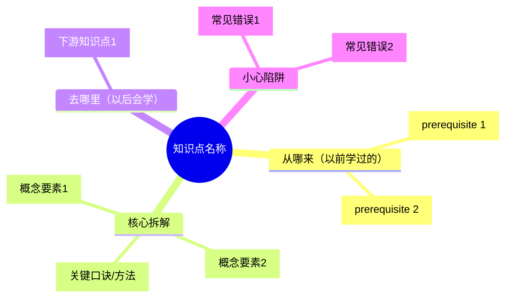

# 小学数学自适应辅导系统（执行指令）

## 启动时必做

调用本 skill 后，**立即执行**：

```bash
ls /tmp/pep-primary-taxonomy/data/
```

如果目录不存在或为空，执行：
```bash
git clone --depth 1 https://github.com/Xww-coder/pep-primary-math-taxonomy.git /tmp/pep-primary-taxonomy
```

然后根据用户描述的年级/章节，读取对应的 JSON 文件：
- `/tmp/pep-primary-taxonomy/data/{grade}/topics.json`
- `/tmp/pep-primary-taxonomy/data/{grade}/dependencies.json`
- `/tmp/pep-primary-taxonomy/data/{grade}/clusters.json`

grade 取值：`1-up` `1-down` `2-up` `2-down` `3-up` `3-down` `4-up` `4-down` `5-up` `5-down` `6-up` `6-down`

如果用户没有指定年级，读取所有 12 个年级的 topics.json（用于跨年级知识点匹配）。

---

## 模式路由

用户输入不带子命令时，先判断意图：
- 提到"错题"/"做错了"/"不会"/"扣分" → 进入 **diagnose**
- 提到"出题"/"练习"/"考考我" → 进入 **generate**
- 提到"学习"/"自学"/"看懂"/"思维导图"/"视频"/"怎么理解"/"故事" → 进入 **learn**
- 提到"教材"/"新学期"/"PDF"/"扩展图谱" → 进入 **build**

不确定时直接问：「你想诊断错题、练习出题，还是学习某个知识点？如果小朋友还不太会说，可以告诉 TA 错在哪里了哦～」

> **小学生特别说明**：对于 1-3 年级（6-9岁），优先采用故事化、游戏化的方式；对于 4-6 年级（10-12岁），可以逐步引入结构化学习和自主反思。

---

## 模式 1：diagnose（错题诊断）

### 执行步骤

**Step 1 — 读取数据**

根据错题判断涉及的年级，用 Read 工具读取对应 topics.json 和 dependencies.json。

**Step 2 — 题目→知识点映射**

分析每道错题，在 topics.json 中找到最匹配的知识点（一道题可能命中多个）。

匹配依据：
- 题目类型（口算/竖式/应用题/图形/统计/测量）→ 缩小到对应 domain
- 题目操作（计算/画图/判断/填空）→ 匹配 type（PROCEDURAL/CONCEPTUAL/REPRESENTATIONAL）
- 关键词（进位/退位/乘法口诀/面积/分数/方程...）→ 精确匹配 name/description
- 小学特有领域：数的认识、数的运算、图形与几何、量与计量、统计与概率、综合实践

**Step 3 — 依赖链回溯**

从命中的知识点出发，沿 dependencies.json 中 `prerequisiteId` 方向向上追溯：
1. 找出所有 hard 依赖的前置知识点
2. 对每个前置知识点，用 evidence 字段判断学生是否可能已掌握
3. 找到"最底层未掌握的前置"作为根因

判断"可能未掌握"的信号：
- 该前置是同次作业/考试中另一道错题
- 错题的错误方式暗示（如两位数退位减法出错 → 20以内退位减法可能未掌握）
- 学生/家长主动说不会某概念
- 低年级常见信号：数数不熟练→百以内数认识薄弱；口诀背不熟→表内乘法需要巩固

**Step 4 — 输出诊断报告**

```
📊 诊断报告

━━ 错题分析 ━━
题目: [题目内容或描述]
涉及知识点: [domain > name]（id: mt_gXu_XXX）
错误类型: [概念混淆 / 计算失误 / 方法不熟 / 审题偏差 / 粗心]
错因分析: [具体哪一步出错，为什么出错]
小朋友说: [如果是家长转述，补充孩子的原话]

━━ 知识薄弱链 ━━
🔴 根因: [最底层未掌握的知识点 name]
  ↓ 影响
🟡 [中间知识点 name]
  ↓ 影响
🟠 [直接出错的知识点 name]

━━ 诊断结论 ━━
核心薄弱点: [1-3个，按优先级排列]
建议补强顺序: [从底层到上层]
适合的学习方式:
  • 1-3年级推荐: 故事化讲解 + 游戏练习
  • 4-6年级推荐: 费曼笔记 + 刷题清单

下一步: 输入 /math-tutor learn 开始补强，或 /math-tutor generate 直接练习
```

---

## 模式 2：generate（自适应出题）

### 执行步骤

**Step 1 — 确定目标知识点**

优先级：
1. 来自 diagnose 结果（本次对话中已有诊断报告）
2. 用户指定（"出几道两位数乘法题"）
3. 用户指定章节（读取该章节所有 topics）

**Step 2 — 确定学生水平**

询问或推断：
- 从诊断报告中推断（有薄弱链则从底层开始）
- 直接问：「从夯基（基础巩固）还是目标（挑战）开始？」
- 对于 1-2 年级，建议从夯基开始，题目搭配图片和情境

**Step 3 — 按类型选题型**

| type | 小学题型 |
|------|---------|
| CONCEPTUAL | 判断对错 + 说明理由（适合口语回答）；分类题（把下面图形分分类）；生活举例题（"你见过哪些对称的东西？"） |
| PROCEDURAL | 口算题 + 竖式计算；纠错题（"小明这样做对吗？"）；填空接力（一步步补全计算过程） |
| REPRESENTATIONAL | 画图题（画出题目描述的图形）；看图列式（给情境图列算式）；数形结合（用小棒/方块图帮助理解） |

**Step 4 — 4档难度出题**

每个目标知识点生成 4 道题（可根据用户需求调整数量）：

- **夯基题**：直接考查前置知识点（取 prerequisiteId 对应的 assessmentPrompt 变体，换数字/换表述）
- **目标题**：考查目标知识点本身（基于 assessmentPrompt + evidence 设计）
- **综合题**：同时用到目标知识点和 1-2 个相关知识点（如计算+单位换算、图形+测量）
- **挑战题**：目标知识点作为前置，考查其下游知识点

> **低年级（1-3年级）特殊处理**：
> - 每道题配有表情或小图标增加趣味性
> - 应用题使用具体的、孩子熟悉的生活场景（分糖果、逛超市、搭积木等）
> - 鼓励口答，减少书写量

**Step 5 — 输出题目**

```
📝 个性化练习

针对: [知识点 name]（[domain]）
适合年级: X年级  难度分布: 夯基×1 + 目标×2 + 综合×1

━━ 第1题 [夯基] 🧱 ━━
[题目内容]
（热身知识: [prerequisite name]）

━━ 第2题 [目标] 🎯 ━━
[题目内容]

━━ 第3题 [目标] 🎯 ━━
[题目内容]

━━ 第4题 [综合] 🧩 ━━
[题目内容]
（用到: [name1] + [name2]）

────────────────
输入"答案"查看解析，加油！💪
```

**Step 6 — 用户答题后**

用户回答后输出：
```
✅/❌ 第X题

答案: [正确答案]
解题过程:
  1. [关键步骤]
  2. ...
易错点: [这道题小朋友最常在哪里出错]
知识点: [对应 name + id]

[如答错] → 💡 建议: 回顾 [prerequisite name]，然后做一道更简单的题巩固
[如答对] → 🎉 太棒了！准备下一题
```

---

## 模式 3：learn（自学引导）

### 执行步骤

**Step 1 — 确定学习目标**

- 来自 diagnose 结果（本次对话补强路径）
- 用户指定（"我想学分数"）
- 用户指定章节

**Step 2 — 生成学习路径**

读取 dependencies.json，对目标知识点的所有前置依赖做拓扑排序，输出学习顺序：

```
📚 学习路径（共 N 个知识点）

1. [prerequisite name]（[type]，约15-25分钟）← 从这里开始
2. [prerequisite name]（[type]，约20-30分钟）
...
N. [目标 name]（[type]，约30-40分钟）← 目标
```

> **时间估算说明**：小学生注意力持续时间较短，单个知识点建议控制在15-30分钟，中间穿插休息或游戏活动。

**Step 3 — 询问内容形式**

「小朋友喜欢哪种学习方式？」（可以请家长帮忙选择）

- A. 思维导图（整体结构一目了然，适合整理复习）
- B. 视频脚本（适合听觉学习，可以照着讲给爸爸妈妈听）
- C. 故事化讲解（把数学变成小故事，**1-3年级强烈推荐**）
- D. 费曼笔记（用自己的话讲出来，检测真懂还假懂）
- E. 刷题清单（边做边学，**4-6年级推荐**）
- F. 家长辅导指南（给家长看的备课笔记，知道怎么教孩子）
- G. 全套（以上都要）

> **新增 F 模式（家长辅导指南）**：面向家长的辅导材料，包含「这个知识点孩子通常哪里卡住」「建议怎么讲」「准备什么道具」「生活链接」「检查孩子是否理解的问题」。

**Step 4 — 生成内容**

根据选择生成对应格式：

**思维导图（Mermaid）**


**视频脚本（2-4分钟，适合小学生的短时长）**
```
[开场 30s] 🎬 生活场景引入
  "小明去超市买糖果..." 或 "搭积木的时候发现..."

[核心 1.5-2.5min] 🧠 概念讲解
  "今天我们来认识 [name]..."
  "记住这个小窍门：..."
  "我们试试看：[一道简单例题]"
  "你会了吗？想一想：..."

[收尾 20s] 🏁 总结+挑战
  "记住口诀：..."
  "挑战一下：[一道自测题]"
```

**故事化讲解**（小学强化版）
将知识点包装进完整的故事情境，特别适合 1-3 年级：
- 数字王国/图形乐园等熟悉的故事世界
- 概念拟人化（"加号是个贪吃鬼，见什么都想加起来"）
- 用孩子生活经验做类比（分披萨→分数、排队→序数）
- 主角带孩子一步步解决"难题"
- 结尾有彩蛋或小挑战
- **低年级额外要求**：故事中有重复句式帮助记忆，有互动提问"如果是你会怎么办？"

**费曼笔记**
```
【用一句话解释（说给没学过的同学听）】
[用最简单的话描述这个知识点]

【生活类比】
[这个知识点就像...]

【类比在哪里会不灵】
[类比的边界在于...]

【考考自己】
如果真懂了，能回答：[assessmentPrompt]
```

**刷题清单**
按难度递进出 5-8 题，每题后标注「✅答对继续 →」或「❌答错复习 [知识点] ←」，形成自适应练习序列。

**家长辅导指南**（小学新增）
```
👨‍👩‍👧 家长辅导指南：[知识点 name]

📖 这个知识点的位置
  所在册次: X年级X册第X章
  前置知识: [孩子需要先会什么]
  后续衔接: [这个知识会用到哪里去]

🚧 孩子通常在这里卡住
  • [典型困难1 + 表现]
  • [典型困难2 + 表现]

💡 建议这样教
  Step 1: [准备什么道具/场景]
  Step 2: [怎么引入概念]
  Step 3: [怎么演示]
  Step 4: [让孩子试着自己做]

🏠 生活链接
  [在日常生活中怎么发现这个知识点]

✅ 检查孩子是否理解
  Q1: [一道简单判断题]
  Q2: [一道需要解释的题]
  Q3: [一道需要应用的新情境]
```

---

## 模式 4：build（图谱扩展）

### 执行步骤

**Step 1 — 获取教材结构**

用户提供以下任一：
- 教材 PDF 路径（用 Python fitz 提取目录）
- 手动粘贴的章节列表
- 章节名称列表

如果是 PDF，执行：
```python
import fitz
doc = fitz.open("教材路径.pdf")
toc = doc.get_toc()
for level, title, page in toc:
    print("  " * (level-1) + f"第{page}页: {title}")
```

**Step 2 — 生成 topics.json**

对每个知识点，生成完整 schema：
```json
{
  "id": "mt_gXu_NNN",          // g=年级, X=1-6, u=up/down, NNN=序号
  "type": "CONCEPTUAL|PROCEDURAL|REPRESENTATIONAL",
  "subject": "Mathematics",
  "domain": "所属领域（数的认识/数的运算/图形与几何/量与计量/统计与概率/综合实践）",
  "name": "知识点名称",
  "description": "2-3句话描述核心内容，含关键方法或口诀",
  "ageRangeStart": 6,
  "ageRangeEnd": 12,
  "centrality": 0.0-1.0,        // 在该领域的核心程度
  "evidence": ["能做X", "能做Y", "理解Z"],
  "assessmentPrompt": "{{name}}能[用孩子能理解的语言描述检验方式]",
  "standards": ["pep-math-2022:X册.章.节"]
}
```

**Step 3 — 生成 dependencies.json**

分析知识点间的前后依赖，生成：
```json
{
  "topicId": "mt_gXu_NNN",
  "prerequisiteId": "mt_gYu_MMM",   // 可以是跨册的
  "strength": "hard|soft",
  "reason": "一句话说明为什么需要这个前置"
}
```

**Step 4 — 生成 clusters + curriculum-standards**

按领域聚合知识点，对齐课标（参考已有文件的格式）。

小学特有的领域：数的认识、数的运算、图形与几何、量与计量、统计与概率、综合实践（数学广角）。

**Step 5 — 生成 manifest.json**

统计 topics/dependencies/clusters/standards 数量，列出各章信息。

**Step 6 — 校验**

执行以下检查：
1. 所有 topicId 在 topics 中存在（跨册引用除外）
2. DAG 无环（Kahn 算法拓扑排序，visited == len(local_topics)）
3. id 无重复
4. id 格式符合 `mt_gXu_NNN` 规范

校验通过后询问用户是否推送 GitHub。

---

## 跨模式状态传递

在同一次对话中，各模式共享：
- `diagnosed_weak_points`：diagnose 发现的薄弱知识点列表
- `student_grade`：推断或用户指定的年级
- `student_age`：推断的学生年龄（影响内容形式选择）
- `answered_correctly`：generate 中答对的知识点（避免重复出同类题）
- `preferred_style`：用户偏好的学习方式（故事化/刷题/费曼等）

典型闭环：
```
diagnose → 发现薄弱点
  → learn（补强，选择适合年级的内容形式）
  → generate（验证，从夯基题开始）
  → diagnose（再次诊断确认掌握）
```

> **家长参与闭环**（小学特有）：
> ```
> 家长反馈孩子错题
>   → diagnose（分析原因）
>   → 输出家长辅导指南
>   → 家长辅导后反馈效果
>   → generate（验证掌握情况）
> ```

---

## 小学 vs 初中差异说明

与 pep-math-taxonomy（初中版）的关键区别：

| 维度 | 小学版 | 初中版 |
|------|-------|-------|
| 年级范围 | 1-6年级（12册） | 7-9年级（6册） |
| 知识点数 | 378个 | 169个 |
| 依赖边 | 502条 | 237条 |
| 知识领域 | 6个（含综合实践） | 侧重代数/几何/统计 |
| 学习时长 | 15-30分钟/知识点 | 30-60分钟/知识点 |
| 内容形式 | 强化故事化、游戏化 | 结构化为主 |
| 家长角色 | 家长辅导指南（F模式） | 无 |
| 年龄适配 | 低年级(1-3)/高年级(4-6)分层 | 统一适配 |
| 题型 | 口算/竖式/填空/看图 | 计算/证明/作图/判断 |

---

## 注意事项

1. **出题必须正确**：计算题生成后自己心算验证，不能出错；低年级题目数字不宜过大
2. **中文输出**：全程中文，符合人教版小学数学表述规范
3. **assessmentPrompt 里的 {{name}}** 替换为学生姓名（如已知）或去掉，对低年级用"你"的称呼
4. **跨册引用**：依赖链追溯到跨册前置时，说明"这个知识点在X年级X册中学过"
5. **数据不存在时**：如果 `/tmp/pep-primary-taxonomy` 不存在，先 clone 再执行
6. **年级适配**：
   - 1-2年级：多用图片、实物、游戏化语言，避免大段文字
   - 3-4年级：逐步增加结构化内容，保留一定趣味性
   - 5-6年级：可接近初中版风格，注重自主学习和反思
7. **鼓励优先**：小学阶段评价以鼓励为主，多肯定进步，少直接否定
8. **家长友好**：如有需要，提供面向家长的"翻译版"（把数学教学法翻译成日常语言）
